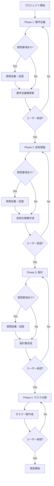

# 📋 対話的ドキュメント作成ワークフロー

プロジェクトの要件定義から実装タスク分解まで、段階的かつ対話的に進めるための統合ワークフロー管理システムです。

⚠️ **重要**: このドキュメントはワークフローの詳細仕様書です。
実際のプロジェクト開始には `/workflow` コマンドを使用してください。

## 🎯 ワークフローの目的

- **認識齟齬の最小化**: 各段階でユーザー確認を行い、認識の相違を早期に発見・修正
- **品質向上**: 段階的な質問と確認により、成果物の品質を向上
- **透明性確保**: 進捗と決定事項を明確に記録し、プロジェクトの透明性を確保
- **手戻り削減**: 早期の確認により、後工程での大幅な修正を防止
- **依存関係管理**: 各フェーズ間の依存関係を自動検証し、正しい順序での実行を保証

## 🔄 全体フロー



## 📝 Phase 1: 要件定義作成

### 実行コマンド
```bash
/project-requirements
```

### プロセス
1. **初期情報収集**
   - プロジェクトの概要確認
   - 既存ドキュメントの分析
   - 基本要件の整理

2. **質問フェーズ** 🤔
   ```
   📌 要件定義に関する確認事項があります：

   1. [具体的な質問1]
   2. [具体的な質問2]
   3. [具体的な質問3]

   回答をお願いします。
   ```

3. **ドキュメント作成**
   - requirements.md の生成
   - 質問への回答を反映

4. **承認確認** ✅
   ```
   📄 要件定義書を作成しました
   場所: .claude/spec/requirements.md

   [要件定義書の要約を表示]

   この内容で問題ありませんか？
   - 承認する場合: 「承認」と回答
   - 修正が必要な場合: 具体的な修正点を記載
   ```

## 🔬 Phase 2: 技術調査・分析

### 実行コマンド
```bash
/project-analysis
```

### 前提条件
- ✅ Phase 1 の承認完了

### プロセス
1. **技術調査**
   - 要件に基づく技術選定
   - 実現可能性の検証
   - パフォーマンス要件の確認

2. **質問フェーズ** 🤔
   ```
   📌 技術仕様に関する確認事項があります：

   1. [使用技術に関する質問]
   2. [制約事項の確認]
   3. [パフォーマンス目標の確認]

   回答をお願いします。
   ```

3. **技術仕様書作成**
   - design.md の生成
   - 技術スタックの決定
   - アーキテクチャの設計

4. **承認確認** ✅
   ```
   📄 技術仕様書を作成しました
   場所: .claude/spec/design.md

   [技術仕様の要約を表示]

   この技術選定で進めてよろしいですか？
   - 承認する場合: 「承認」と回答
   - 変更が必要な場合: 具体的な要望を記載
   ```

## 🏗️ Phase 3: 詳細設計

### 実行コマンド
```bash
/project-design --detailed
```

### 前提条件
- ✅ Phase 2 の承認完了

### プロセス
1. **詳細設計作成**
   - データモデル設計
   - API設計
   - UI/UX設計

2. **質問フェーズ** 🤔
   ```
   📌 詳細設計に関する確認事項があります：

   1. [データ構造に関する質問]
   2. [処理フローの確認]
   3. [エラーハンドリング方針]

   回答をお願いします。
   ```

3. **設計書更新**
   - design.md の詳細化
   - 質問回答の反映

4. **承認確認** ✅
   ```
   📄 詳細設計を完成させました

   [詳細設計の要約を表示]

   この設計で実装を開始してよろしいですか？
   - 承認する場合: 「承認」と回答
   - 調整が必要な場合: 具体的な要望を記載
   ```

## 📋 Phase 4: タスク分解

### 実行コマンド
```bash
/project-tasks
```

### 前提条件
- ✅ Phase 3 の承認完了

### 依存関係確認
```yaml
required_phases:
  - phase: "design"
    status: "approved"
required_documents:
  - ".claude/spec/design.md"
```

### プロセス
1. **タスク分解**
   - 実装タスクの詳細分解
   - 依存関係の明確化
   - 優先順位の設定

2. **確認フェーズ** 🤔
   ```
   📌 タスク分解に関する確認事項：

   - 優先順位は適切ですか？
   - 見積もり工数は妥当ですか？
   - 追加すべきタスクはありますか？
   ```

3. **タスク一覧作成**
   - tasks.md の生成
   - 実装順序の決定

4. **最終承認** ✅
   ```
   📄 実装タスク一覧を作成しました
   場所: .claude/spec/tasks.md

   [タスク一覧の要約を表示]
   総タスク数: X個
   推定工数: Y時間

   このタスク計画で実装を開始しますか？
   - 承認する場合: 「実装開始」と回答
   - 調整が必要な場合: 具体的な要望を記載
   ```

## 🚀 実装フェーズへの移行

### 全フェーズ承認後
```
✨ 全てのドキュメントが承認されました！

📁 作成済みドキュメント:
- ✅ requirements.md (要件定義書)
- ✅ design.md (技術仕様書・詳細設計)
- ✅ tasks.md (実装タスク一覧)

実装を開始する準備が整いました。
「実装開始」と入力すると、タスク#1から順次実装を開始します。
```

## 🔐 依存関係管理

### 依存関係の自動チェック

各フェーズ開始前に、以下の依存関係が自動的に検証されます：

```markdown
🔍 依存関係チェック実行中...

フェーズ: Phase 3 (詳細設計)
必要条件の確認:
✅ Phase 1 (要件定義) - 承認済み
✅ Phase 2 (技術調査) - 承認済み
✅ requirements.md - 存在確認
✅ tech-analysis.md - 存在確認

→ すべての前提条件を満たしています
→ Phase 3 を開始します
```

### 依存関係エラーの処理

```markdown
⚠️ 依存関係エラー

Phase 3 を実行できません:
❌ Phase 2 (技術調査) - 未承認

必要なアクション:
1. Phase 2 を完了させる: /project-analysis
2. または、/workflow --resume で自動的に再開
```

### 依存関係の定義

依存関係は `workflow-dependencies.yaml` で管理されます：

```yaml
phases:
  requirements:
    prerequisites: []
    blocks: ["analysis", "design", "tasks"]

  analysis:
    prerequisites:
      - phase: "requirements"
        status: "approved"
    blocks: ["design", "tasks"]

  design:
    prerequisites:
      - phase: "requirements"
        status: "approved"
      - phase: "analysis"
        status: "approved"
    blocks: ["tasks"]
```

## 📊 進捗管理

### 現在のステータス確認
```bash
/workflow-status
```

### 出力例
```
📊 ワークフロー進捗状況

Phase 1: 要件定義 ✅ 完了 (2024-01-15)
Phase 2: 技術調査 ✅ 完了 (2024-01-16)
Phase 3: 詳細設計 🔄 進行中
Phase 4: タスク分解 ⏸️ 待機中

現在のフェーズ: Phase 3
次のアクション: 詳細設計の承認待ち
```

## 🔙 フェーズの巻き戻し

承認後でも、必要に応じて前のフェーズに戻ることが可能：

```bash
/workflow-rollback --phase 2
```

この場合、Phase 2以降の承認がリセットされ、再度確認プロセスを実行します。

## 📝 質問管理

### 質問の記録
全ての質問と回答は `.claude/qa/` ディレクトリに自動保存：

```
.claude/qa/
├── phase1-requirements-qa.md
├── phase2-analysis-qa.md
├── phase3-design-qa.md
└── phase4-tasks-qa.md
```

### 質問履歴の確認
```bash
/workflow-qa --phase all
```

## ⚙️ カスタマイズ

### スキップ設定
特定のフェーズの質問をスキップ：
```bash
/workflow-config --skip-questions phase2
```

## 🎯 ベストプラクティス

1. **各フェーズで十分な時間を確保**
   - 急いで承認せず、内容を精査
   - 不明点は質問フェーズで解消

2. **段階的な詳細化**
   - 要件定義は概要レベルから開始
   - 各フェーズで徐々に詳細化

3. **ドキュメントの一貫性**
   - 前フェーズの決定事項を後続フェーズで遵守
   - 矛盾が生じた場合は巻き戻しを検討

4. **質問の活用**
   - 曖昧な点は積極的に質問
   - 仮定で進めずに確認を優先

## 💾 状態管理システム

### workflow-state.json の構造

プロジェクトの状態は `.claude/spec/workflow-state.json` に自動保存されます：

```json
{
  "project": {
    "name": "プロジェクト名",
    "type": "web_application",
    "created_at": "2024-01-25T10:00:00Z"
  },
  "workflow": {
    "current_phase": "analysis",
    "current_step": "questioning",
    "completed_phases": ["requirements"]
  },
  "phases": {
    "requirements": {
      "status": "approved",
      "completed_at": "2024-01-25T11:00:00Z"
    }
  }
}
```

### 状態の自動保存

- 質問への回答時
- フェーズの完了時
- 承認/却下時
- エラー発生時

### 状態の復元

```bash
/workflow --resume
# → 自動的に中断位置から再開

/workflow --show-state
# → 現在の状態をJSON形式で表示
```

## 📚 関連ドキュメント

### コアドキュメント
- [ワークフローコマンド](../workflow.md) - 統合エントリーポイント
- [依存関係定義](../workflow-dependencies.yaml) - フェーズ間の依存関係
- [状態管理テンプレート](../workflow-state-template.json) - 状態管理の仕様

### フェーズドキュメント
- [要件定義プロセス](../project-requirements.md)
- [技術調査プロセス](../project-analysis.md)
- [設計プロセス](../project-design.md)
- [タスク分解プロセス](../project-tasks.md)
- [質問テンプレート](../questions-template.md)